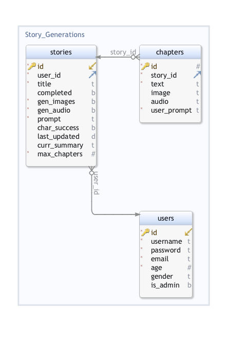

# Stack

PostgresDB, Express, React, Node.js

# Focus

The front-end UI will be the focus for this project. The back-end will be a little more complicated than something simple, but it will not be the main focus.

# Application

This will be a website application.

# Purpose

This project will be for entertainment purposes.

# Demographics

This project will be for all ages.

# Data

Data created by the app will be stored in a Postgres database. Chat GPT API and Eleven Labs API will be used to generate the data.

# Outlines

## Database Schema

## Possible issues

- Open AI API may return an error or not respond in the correct format if the prompt is not clear enough.
- Load times may be long if the API takes a long time to respond.

## Possible sensitive information

- Usernames
- Passwords
- Emails

## Functionality

- User can create an account
- User can login
- User can logout
- User can create a new story
- User can view their previous stories
- User can start a new story before finishing their current one
- User can delete their stories
- User can logout and continue their story later when they log back in
- Based upon questions asked by the app, the user can configure the foundations for each story (main character name, setting, genre, and story generation configuration)
- User can choose to include generated images and audio for their stories or opt out of those features for just text to decrease load times.
- The user interface will be very stylized and intuitive to use with simple and straightforward menus, buttons, drawers, and other components.
