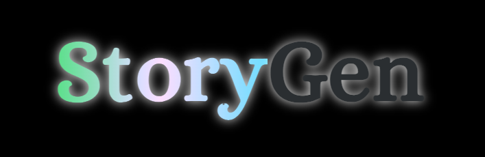

<!-- Improved compatibility of back to top link: See: https://github.com/othneildrew/Best-README-Template/pull/73 -->

<a name="readme-top"></a>

<!--
*** Thanks for checking out the Best-README-Template. If you have a suggestion
*** that would make this better, please fork the repo and create a pull request
*** or simply open an issue with the tag "enhancement".
*** Don't forget to give the project a star!
*** Thanks again! Now go create something AMAZING! :D
-->

<!-- PROJECT SHIELDS -->
<!--
*** I'm using markdown "reference style" links for readability.
*** Reference links are enclosed in brackets [ ] instead of parentheses ( ).
*** See the bottom of this document for the declaration of the reference variables
*** for contributors-url, forks-url, etc. This is an optional, concise syntax you may use.
*** https://www.markdownguide.org/basic-syntax/#reference-style-links
-->

[![Contributors][contributors-shield]][contributors-url]
[![Forks][forks-shield]][forks-url]
[![Stargazers][stars-shield]][stars-url]
[![Issues][issues-shield]][issues-url]
[![MIT License][license-shield]][license-url]

<!-- PROJECT LOGO -->
<br />
<div align="center">
  <a href="https://github.com/CAWittMN/capstone-2-AI-Story">
    
  </a>

<h3 align="center">StoryGen</h3>

  <p align="center">
    StoryGen is a web app that uses ChatGPT, Dall-e 3, and ElevenLabs text to speech to generate a story based on user inputs and other settings in a "choose your own adventure" style. The powerful AI models help build a mystical experience for the user.
    <br />
    <a href="https://github.com/CAWittMN/capstone-2-AI-Story"><strong>Explore the docs »</strong></a>
    <br />
    <br />
    <a href="https://story-gen.onrender.com/">View Demo</a>
    ·
    <a href="https://github.com/CAWittMN/capstone-2-AI-Story/issues">Report Bug</a>
    ·
    <a href="https://github.com/CAWittMN/capstone-2-AI-Story/issues">Request Feature</a>
  </p>
</div>

<!-- TABLE OF CONTENTS -->
<details>
  <summary>Table of Contents</summary>
  <ol>
    <li>
      <a href="#about-the-project">About The Project</a>
      <ul>
        <li><a href="#built-with">Built With</a></li>
      </ul>
    </li>
    <li>
      <a href="#getting-started">Getting Started</a>
      <ul>
        <li><a href="#prerequisites">Prerequisites</a></li>
        <li><a href="#installation">Installation</a></li>
      </ul>
    </li>
    <li><a href="#usage">Usage</a></li>
    <li><a href="#roadmap">Roadmap</a></li>
    <li><a href="#contributing">Contributing</a></li>
    <li><a href="#license">License</a></li>
    <li><a href="#contact">Contact</a></li>
    <li><a href="#acknowledgments">Acknowledgments</a></li>
  </ol>
</details>

<!-- ABOUT THE PROJECT -->

## About The Project

[![StoryGen Screen Shot][product-screenshot]](https://story-gen.onrender.com/)

[![StortGen Mobile Screen Shot][product-screenshot-mobile]](https://story-gen.onrender.com/)

<p align="right">(<a href="#readme-top">back to top</a>)</p>

### Built With

- [![PostgreSQL][PostgreSQL.com]][PostgreSQL-url]
- [![Express][Express.js]][Express-url]
- [![React][React.js]][React-url]
- [![Node][Node.js]][Nodejs-url]
- [![Axios][Axios.js]][Axios-url]
- [![Sequelize][Sequelize.com]][Sequelize-url]
- [![TailwindCSS][Tailwindcss.com]][TailwindCSS-url]
- [![NextUI][NextUI.com]][NextUI-url]
- [![Vite][Vite.js]][Vite-url]
- [![OpenAI][OpenAI.com]][OpenAI-url]

<p align="right">(<a href="#readme-top">back to top</a>)</p>

<!-- GETTING STARTED -->

## Getting Started

This is an example of how you may give instructions on setting up your project locally.
To get a local copy up and running follow these simple example steps.

### Prerequisites

You will need to have the latest version of NPM and PostgreSQL installed on your machine.

- npm
  ```sh
  npm install npm@latest -g
  ```
- PostgreSQL
  ```sh
  https://www.postgresql.org/download/
  ```

### Installation

1. Obtain API keys for [OpenAI](https://beta.openai.com/) and [ElevenLabs](https://www.eleven-labs.com/en/)
2. Clone the repo
   ```sh
   git clone https://github.com/CAWittMN/capstone-2-AI-Story.git
   ```
3. Install NPM packages in both the api and client directories
   ```sh
   cd api
   npm install
   cd ../client
   npm install
   ```
4. Create a database in PostgreSQL

   ```sh
   psql
   CREATE DATABASE story_gen;
   ```

5. Create a .env file in `/api` and add the following variables

   ```js
   SECRET_KEY = "anything_you_want";
   OPENAI_API_KEY = "your_openai_api_key";
   PORT = 3005;
   ELEVENLABS_API_KEY = "your_elevenlabs_api_key";
   DB_URI = "your_database_uri";
   REACT_APP_BASE_URL = "http://localhost:3005";
   ELEVENLABS_VOICE_ID = "ghWIe9V8UUJG9QUcMI3V";
   ```

6. Create a .env file in `/client` and add the following variables

   ```js
   REACT_APP_BASE_URL = "http://localhost:3005";
   ```

7. Open a second terminal and run the following command in the `/api` directory on one terminal

   ```sh
   npm start
   ```

   and in the other terminal run the following command in the `/client` directory

   ```sh
   npm run dev
   ```

8. Command(Ctrl on windows) + Click on the link in the client terminal to open the app in your browser and play!

<p align="right">(<a href="#readme-top">back to top</a>)</p>

<!-- USAGE EXAMPLES -->

## Usage

To play the game, make an account by clicking "Signup" and filling out the form. From there you will be able to create your first story by clicking on "New Story"
Fill out each question to set the initial conditions for your story.

- Story Genre: This will determine the genre of your story. Some examples are Fantasy, Sci-Fi, and Horror.
- Moods: This will determine the mood of your story. Some examples are Happy, Sad, and Scary.
- Setting: This will determine the setting of your story. Some examples are An old ship at sea, An enchanted forest, and 1970's California. This can be left blank to have the AI choose a random setting.
- Character Name: This will determine the name of your character. This can be left blank to have the AI choose a random name.
- Story Length: This will determine the length of your story. The options are Short(10 chapters), Medium(20 chapters), and Long(30 chapters).
- Story Configuration: These settings turn on or off the image and auido generations. Turning them off will decrease load times, but will also decrease the quality of the experience.
  [![StoryGen Menu Screen Shot][product-screenshot-menu]](https://story-gen.onrender.com/)
  [![StoryGen Story Screen Shot][product-screenshot-Story]](https://story-gen.onrender.com/)

_For more examples, please refer to the [Documentation](https://example.com)_

<p align="right">(<a href="#readme-top">back to top</a>)</p>

<!-- ROADMAP -->

## Roadmap

- [ ] Edit User Profile
- [ ] Social Features
  - [ ] User Profiles
  - [ ] See Other User Profiles
  - [ ] See Other User Stories
  - [ ] User Comments
  - [ ] User Likes
  - [ ] User Favorites
  - [ ] User Follows
  - [ ] User Friends
  - [ ] User Settings
- [ ] More Game Like Feel For Story
  - [ ] Character Stats
  - [ ] Character Inventory
  - [ ] Character Equipment

See the [open issues](https://github.com/CAWittMN/capstone-2-AI-Story/issues) for a full list of proposed features (and known issues).

<p align="right">(<a href="#readme-top">back to top</a>)</p>

<!-- CONTRIBUTING -->

## Contributing

Contributions are what make the open source community such an amazing place to learn, inspire, and create. Any contributions you make are **greatly appreciated**.

If you have a suggestion that would make this better, please fork the repo and create a pull request. You can also simply open an issue with the tag "enhancement".
Don't forget to give the project a star! Thanks again!

1. Fork the Project
2. Create your Feature Branch (`git checkout -b feature/AmazingFeature`)
3. Commit your Changes (`git commit -m 'Add some AmazingFeature'`)
4. Push to the Branch (`git push origin feature/AmazingFeature`)
5. Open a Pull Request

<p align="right">(<a href="#readme-top">back to top</a>)</p>

<!-- LICENSE -->

## License

Distributed under the MIT License.

<p align="right">(<a href="#readme-top">back to top</a>)</p>

<!-- CONTACT -->

## Contact

Casey Wittrock -
[![Email][gmail-shield]][gmail-url]
[![@twitter_handle][x-shield]](https://twitter.com/CaWittMN)
[![LinkedIn][linkedin-shield]][linkedin-url]
[![GitHub][github-shield]][github-url]

Project Link: [https://github.com/CAWittMN/capstone-2-AI-Story](https://github.com/CAWittMN/capstone-2-AI-Story)

<p align="right">(<a href="#readme-top">back to top</a>)</p>

<!-- ACKNOWLEDGMENTS -->

<!-- MARKDOWN LINKS & IMAGES -->
<!-- https://www.markdownguide.org/basic-syntax/#reference-style-links -->

[contributors-shield]: https://img.shields.io/github/contributors/CAWittMN/capstone-2-AI-Story.svg?style=for-the-badge
[contributors-url]: https://github.com/CAWittMN/capstone-2-AI-Story/graphs/contributors
[forks-shield]: https://img.shields.io/github/forks/CAWittMN/capstone-2-AI-Story.svg?style=for-the-badge
[forks-url]: https://github.com/CAWittMN/capstone-2-AI-Story/network/members
[stars-shield]: https://img.shields.io/github/stars/CAWittMN/capstone-2-AI-Story.svg?style=for-the-badge
[stars-url]: https://github.com/CAWittMN/capstone-2-AI-Story/stargazers
[issues-shield]: https://img.shields.io/github/issues/CAWittMN/capstone-2-AI-Story.svg?style=for-the-badge
[issues-url]: https://github.com/CAWittMN/capstone-2-AI-Story/issues
[license-shield]: https://img.shields.io/github/license/CAWittMN/capstone-2-AI-Story.svg?style=for-the-badge
[license-url]: https://github.com/CAWittMN/capstone-2-AI-Story/blob/master/LICENSE.txt
[gmail-shield]: https://img.shields.io/badge/caseywittrockmn@gmail.com-D14836?style=for-the-badge&logo=gmail&logoColor=white
[gmail-url]: mailto:caseywittrockmn@gmail.com
[github-shield]: https://img.shields.io/badge/GitHub-100000?style=for-the-badge&logo=github&logoColor=white
[github-url]: https://github.com/CAWittMN
[x-shield]: https://img.shields.io/badge/@Cawittmn-000000?style=for-the-badge&logo=x&logoColor=white
[x-url]: https://twitter.com/CaWittMN
[linkedin-shield]: https://img.shields.io/badge/-LinkedIn-black.svg?style=for-the-badge&logo=linkedin&colorB=555
[linkedin-url]: linkedin.com/in/casey-wittrock-7757a3244
[product-screenshot]: images/ScreenShotHome.png
[product-screenshot-mobile]: images/ScreenShotMobile.png
[product-screenshot-menu]: images/ScreenShotMenu.png
[product-screenshot-Story]: images/ScreenShotStory.png
[Node.js]: https://img.shields.io/badge/Node.js-000000?style=for-the-badge&logo=nodedotjs&logoColor=white
[Nodejs-url]: https://nodejs.org/en
[Axios.js]: https://img.shields.io/badge/Axios-5A2D9C?style=for-the-badge&logo=axios&logoColor=white
[Axios-url]: https://axios-http.com/
[Vite.js]: https://img.shields.io/badge/Vite-646CFF?style=for-the-badge&logo=vite&logoColor=white
[Vite-url]: https://vitejs.dev/
[PostgreSQL.com]: https://img.shields.io/badge/PostgreSQL-316192?style=for-the-badge&logo=postgresql&logoColor=white
[PostgreSQL-url]: https://www.postgresql.org/
[React.js]: https://img.shields.io/badge/React-20232A?style=for-the-badge&logo=react&logoColor=61DAFB
[React-url]: https://reactjs.org/
[Express.js]: https://img.shields.io/badge/Express.js-4A4A55?style=for-the-badge&logo=express&logoColor=FF3E00
[Express-url]: https://expressjs.com/
[Sequelize.com]: https://img.shields.io/badge/Sequelize-FF2D20?style=for-the-badge&logo=sequelize&logoColor=white
[Sequelize-url]: https://sequelize.org/
[TailwindCSS.com]: https://img.shields.io/badge/TailwindCSS-563D7C?style=for-the-badge&logo=tailwindcss&logoColor=white
[TailwindCSS-url]: https://tailwindcss.com/
[NextUI.com]: https://img.shields.io/badge/NextUI-0769AD?style=for-the-badge&logo=nextui&logoColor=white
[NextUI-url]: https://nextui.org/
[OpenAI.com]: https://img.shields.io/badge/OpenAI-FF6600?style=for-the-badge&logo=openai&logoColor=white
[OpenAI-url]: https://openai.com/
